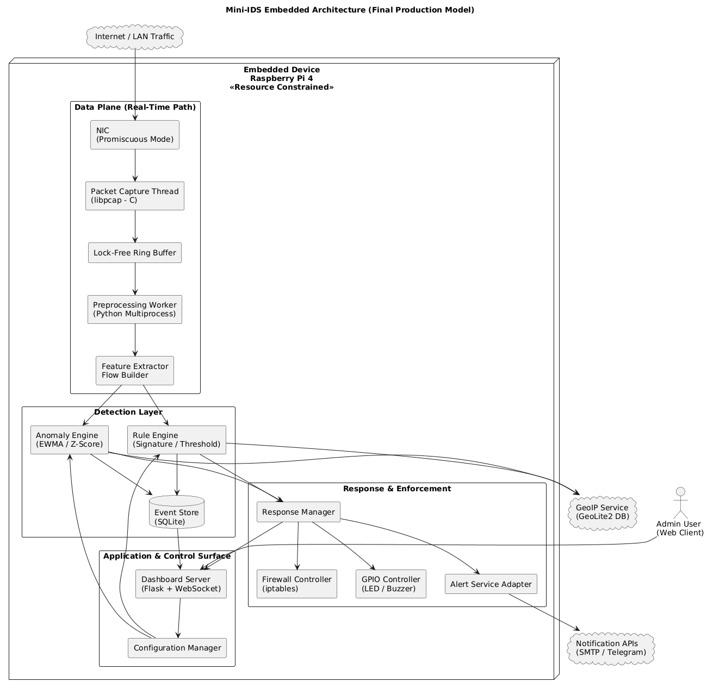

# Project Proposal

**Project Title:** Embedded Network Intrusion Detection System (Mini-IDS) with Real-Time Dashboard.

**Course:** MICROPROCESSOR AND EMBEDDED SYSTEM. 

**Program:** BSc in CSE.

**Team:** Sagar Biswas, Md. Faisal Bin Haque, Ayswarjo Sarkar, Sirazum Munira Munni, Sabrina Rahaman.

**Supervisor:** Md Sajid Hossain.

**Semester:** 2025-2026, Spring.


<div align="right">

[](https://github.com/SagarBiswas-MultiHAT/Raspi_Mini_IDS-Project_Proposal/actions/workflows/ci.yml)
&nbsp;
[](LICENSE)
&nbsp;
[](https://github.com/SagarBiswas-MultiHAT/Raspi_Mini_IDS-Project_Proposal/issues)
&nbsp;
[](https://github.com/SagarBiswas-MultiHAT/Raspi_Mini_IDS-Project_Proposal/issues?q=is%3Aissue%20state%3Aclosed)
&nbsp;
[](https://sagarbiswas-multihat.github.io/Raspi_Mini_IDS-Project_Proposal/)
<!-- &nbsp;
[](https://hub.docker.com/)
&nbsp;
[](https://about.codecov.io/) -->

</div>

## 1. Executive Summary

This project proposes a low-cost, practical Embedded Network Intrusion Detection System (Mini-IDS) built on a Raspberry Pi 4. The Mini-IDS will capture network traffic in a controlled lab environment, detect common network attacks using a mix of rule-based and lightweight anomaly detection methods, send real-time alerts by Email and Telegram, and provide a web-based dashboard for visualization and basic automated defense using firewall rules and GPIO alerts. The focus is on making a reproducible, well-documented system that can be evaluated on detection accuracy, latency, and resource usage.

## 2. Objectives

- Build a reliable packet capture pipeline on an embedded platform.
- Detect common attacks such as port scans, ICMP floods, brute-force login attempts, and traffic spikes.
- Send real-time alerts via Email and Telegram.
- Provide a Flask-based dashboard with live charts and an admin control panel.
- Automatically block malicious IPs using `iptables`, with safe fail-safes.
- Evaluate performance and document results in a reproducible way.

## 3. System Overview

The system runs on a Raspberry Pi 4 and consists of the following modules:

- Packet capture module using `libpcap` in C for low-latency capture.
- Lock-free ring buffer to safely hand packets from the capture thread to worker processes.
- Python preprocessing worker to extract flows and features.
- Detection engine combining signature/threshold rules and lightweight anomaly detection (EWMA, z-score).
- Response manager that triggers `iptables` rules, sends alerts, and controls LED/buzzer via GPIO.
- SQLite database for event logs and configuration.
- Flask dashboard with WebSocket updates and Chart.js visualizations.

Data flow summary: `NIC -> libpcap capture thread -> ring buffer -> preprocessing worker -> detection engine -> logging + response manager -> dashboard`

## 4. Detection Design

### Rule-Based Detection

- Port scan: triggered when a source IP probes unique destination ports beyond a threshold inside a sliding window.
- ICMP flood: triggered when packets per second from a source exceed a configurable threshold.
- Brute-force login: detected by repeated failed HTTP POST login attempts from the same IP.
- Suspicious traffic spike: detected if packet rate deviates from an EWMA baseline by K standard deviations.

### Anomaly Detection

- Entropy-based checks on payload distribution for common protocols.
- Per-IP z-score on packet size and packet rate distributions.
- Optional lightweight streaming model if time permits.

### False Positive Mitigation

- Whitelist known hosts.
- Require correlation across two independent detectors before auto-blocking.
- Admin override and manual unblocking from the dashboard.

## 5. Implementation Plan and Technologies

- Capture: C + `libpcap` for the hot path.
- Higher-level logic: Python 3.11 with multiprocessing.
- Dashboard: Flask + Flask-SocketIO, Chart.js.
- Storage: SQLite for persistent logs; Redis optional for ephemeral counters.
- Testing tools: `nmap`, `hping3`, `tcpreplay` for replay tests.
- Deployment: `systemd` service and an optional Dockerfile for reproducibility.

## 6. Testing and Evaluation

Planned tests:

- Unit tests for rule logic.
- Integration tests for the full capture-to-response pipeline.
- Stress tests to measure packet loss, CPU, and memory under load.
- False positive tests with heavy benign traffic.

Key metrics to report:

- Detection rate and false positive rate.
- Mean detection latency and blocking latency.
- System CPU and memory usage under nominal and stress conditions.
- Packet loss rate in the capture pipeline.

Target goals (example): detection latency under 2 seconds, false positive rate under 5% on benchmark benign traffic, and packet loss below 1% under a specified packet-per-second baseline.

## 7. Safety and Ethics

All experiments will be performed in a controlled lab network only. No testing will be performed on networks or hosts without explicit permission. Any logs released publicly will be anonymized. We will document ethical considerations and responsible testing procedures in the final report.

## 8. Deliverables

- Source code repository with modular layout and tests.
- Dockerfile and `systemd` service script.
- Design documents and diagrams.
- Test scripts and recorded pcaps.
- Performance and evaluation report with graphs.
- 5-7 minute demo video and presentation slides.
- Viva appendix with likely questions and answers.

## 9. Timeline (8 Weeks)

- Week 1: Environment setup, capture module prototype in C, ring buffer test.
- Week 2: Preprocessing worker and feature extractor; test traffic scripts.
- Week 3: Implement core rule-based detection and unit tests.
- Week 4: Implement anomaly detector and whitelist/decay logic.
- Week 5: Response manager, `iptables` automation, and hardware alert integration.
- Week 6: Dashboard development and admin controls.
- Week 7: Stress testing, profiling, and threshold tuning.
- Week 8: Documentation, demo recording, final report, and presentation prep.

## 10. Risk Analysis and Mitigation

- Packet loss: mitigate with ring buffer, C capture thread, and reduced logging in the hot path.
- False positives: mitigate with correlation logic and manual override.
- SD card corruption or Pi crash: mitigate with read-only `rootfs`, backups, and watchdog.

## 11. Budget Estimate

- Raspberry Pi 4: 10,000 - 15,000 BDT (recommend 4 GB).
- Microcontroller (optional): 800 - 1,500 BDT.
- Accessories and SD card: ~1,000 BDT.

No paid services are required; GeoLite2 and notification APIs are free to use at the basic level.

### ESP32 Dev Board (Recommended but Optional)

#### Why ESP32?

- Built-in WiFi and Bluetooth.
- Dual-core microcontroller.
- Multiple GPIO pins.
- Very cheap and widely available.
- Works well with Raspberry Pi over UART/I2C.
- Can act as a hardware watchdog or secondary alert controller.

#### Use in This Project

- Dedicated GPIO alarm controller (LED + buzzer).
- Hardware watchdog to restart Pi if the system hangs.
- Independent alert node in case the main system crashes.
- Optional future extension: distributed IDS node.

## 12. Repository Layout

The repository is organized so each module is easy to find, test, and maintain:

```text
mini-ids/
|
|-- README.md                  # Project overview and setup guide
|-- LICENSE                    # Open-source license (MIT recommended)
|-- .gitignore
|-- requirements.txt           # Python dependencies
|-- Makefile                   # Build automation for C capture module
|-- config.yaml                # Default runtime configuration
|
|-- capture/                   # High-performance packet capture (C + libpcap)
|   |-- src/
|   |   |-- capture.c
|   |   |-- ring_buffer.c
|   |   |-- ring_buffer.h
|   |-- include/
|   |-- build/
|   |-- README.md
|
|-- core/                      # Core processing logic
|   |-- preprocessor/
|   |   |-- flow_builder.py
|   |   |-- packet_parser.py
|   |
|   |-- detector/
|   |   |-- rules/
|   |   |   |-- port_scan.py
|   |   |   |-- icmp_flood.py
|   |   |   |-- brute_force.py
|   |   |
|   |   |-- anomaly/
|   |   |   |-- ewma.py
|   |   |   |-- zscore.py
|   |   |
|   |   |-- engine.py
|   |
|   |-- database/
|       |-- models.py
|       |-- storage.py
|
|-- response/                  # Enforcement & alert handling
|   |-- firewall.py
|   |-- alert_service.py
|   |-- gpio_controller.py
|   |-- watchdog_interface.py
|
|-- dashboard/                 # Web UI
|   |-- app.py
|   |-- templates/
|   |-- static/
|   |-- websocket.py
|
|-- configs/                   # Environment-based configs
|   |-- development.yaml
|   |-- production.yaml
|
|-- tests/                     # Testing & traffic simulation
|   |-- unit/
|   |-- integration/
|   |-- traffic_simulation/
|   |   |-- nmap_scripts/
|   |   |-- hping_tests/
|   |   |-- replay_pcaps/
|   |-- sample_pcaps/
|
|-- scripts/                   # Utility scripts
|   |-- setup.sh
|   |-- run.sh
|   |-- reset_firewall.sh
|
|-- docs/                      # Documentation
|   |-- architecture.md
|   |-- sequence_flow.md
|   |-- performance_report.md
|   |-- threat_model.md
|   |-- viva_notes.md
|
|-- docker/                    # Containerization
|   |-- Dockerfile
|   |-- docker-compose.yml
|
|-- ci/                        # Continuous Integration
    |-- github-actions.yml
```

This structure keeps low-level packet capture, detection logic, response handling, dashboard, and testing clearly separated. It should make team collaboration and future scaling much easier.

## 13. Architecture Diagram

Below is the architecture diagram for the Mini-IDS. It shows the Raspberry Pi boundary, the real-time data plane components, the detection layer, the response and enforcement components, and external services.



### Diagram Summary

Think of the Raspberry Pi as a small security checkpoint for a house. The diagram shows how the checkpoint watches incoming network traffic and decides what to do.

- **Where traffic arrives:** Network traffic is like visitors arriving at the gate. The NIC is the gate where every packet first appears.
- **Catching the packets quickly:** The capture thread is like a security guard who picks up each visitor as soon as they arrive. This guard works in a fast, low-level language so nothing is missed.
- **Short holding area:** The lock-free ring buffer is a quick conveyor belt where the guard puts visitors for the rest of the team to check. It is very fast and does not slow things down.
- **Preparing the data:** The preprocessing worker cleans and organizes the visitor information. The feature extractor turns each visitor into a short description the system can understand.
- **Two kinds of checking:** The rule engine is like a list of known bad behaviors. If a visitor matches a known bad pattern, alarms go off. The anomaly engine is like a guard who notices strange behavior even if it is not on the list. It looks for unusual patterns.
- **Saving events:** The SQLite event store is a simple notebook where the system writes down what it saw. This helps review or study later.
- **Action and alerts:** The response manager decides what to do when something looks wrong. It can tell the firewall to block an IP, send messages through email or Telegram, or flash a buzzer or LED.
- **Control and user view:** The dashboard is the control room where an admin can see live stats and change settings. External services like GeoIP and notification APIs are outside the checkpoint. They are like phone books or phone lines the system calls when needed.

Why this is safe and neat:

- Everything that directly inspects traffic stays inside the Raspberry Pi boundary. External services are kept outside so you know what is trusted and what is not.

## 14. Sequence Diagram

Below is the sequence diagram that details real-time packet processing, parallel detection, alerting, and the administrative control flow.


### Diagram Summary

This explains step-by-step what happens when a packet arrives and how the system reacts.

- **Packet arrives:** A network packet arrives just like a car pulls up to a checkpoint.
- **Immediate capture:** The NIC triggers the capture thread. This is like an instant bell that tells the guard to grab the car right away.
- **Fast push into buffer:** The guard puts the packet onto the ring buffer. This push is O(1), which means it happens instantly and does not get slower if there are more packets.
- **Preprocessing and feature extraction:** A worker pulls the packet from the buffer, cleans it, and extracts the important facts. This is like writing down the car's license, color, and owner.
- **Two checks at the same time:** The feature data goes to both the rule engine and the anomaly engine at the same time. Imagine two inspectors checking the same car in parallel. One checks a checklist of known bad behavior. The other looks for anything unusual.
- **Logging results:** Each inspector writes a short note in the notebook (the SQLite DB) about what they found.
- **If an attack is detected:** The system goes into the attack branch. The response manager gets the alert and tells the firewall to block the attacker, sends alert messages to an admin via email or Telegram, turns on a buzzer or LED to show an alarm, and pushes a real-time alert to the dashboard so the admin sees it immediately.
- **If traffic is normal:** The system just updates statistics on the dashboard and continues watching.
- **Admin updates:** An admin can change thresholds or add trusted hosts from the dashboard. These new settings are saved to the notebook so the system remembers them.

Why this workflow is smart:

- The system captures packets very fast, checks them in parallel so it is quick, logs everything for later, and only takes action when needed. Admins can change settings without stopping the system.

## 15. Limitations and Future Work

### Current Limitations

- This Mini-IDS is tested in a controlled lab setup, so real-world internet traffic may be more complex.
- Rule thresholds still need manual tuning for different network environments.
- Raspberry Pi hardware is resource-limited, so very high traffic rates can affect performance.
- Automatic blocking with `iptables` is helpful, but wrong thresholds can block legitimate users.
- The current anomaly logic is lightweight and may miss some advanced or stealthy attack patterns.

### Future Work

- Add a lightweight ML-based detector and compare its performance with the current rule + statistical approach.
- Build a distributed setup using multiple ESP32/Raspberry Pi nodes for wider network monitoring.
- Add smarter alert prioritization to reduce notification noise.
- Improve dashboard analytics with longer trend history and attack heatmaps.
- Extend protocol coverage (for example DNS tunneling and application-layer attack patterns).

## 16. Quick Q/A (Important Terms)

#### ICMP Flood

- **What:** A denial-of-service attack that overwhelms a target by sending a huge number of ICMP ping packets.
- **Why:** The goal is to exhaust bandwidth or CPU so the target becomes slow or unreachable.

#### Traffic Spike

- **What:** A sudden and sharp increase in network traffic within a short time.
- **Why:** It can be normal (for example, high user demand), but it can also be a sign of DDoS or other abnormal activity.

#### libpcap

- **What:** A low-level C library used to capture raw network packets directly from a network interface.
- **Why:** It enables fast and efficient packet monitoring, which is very useful for IDS and traffic analysis tools.

#### Lock-Free Ring Buffer

- **What:** A circular memory buffer that lets threads share data without using traditional locks.
- **Why:** It reduces latency and avoids performance bottlenecks in high-speed packet processing.

#### NIC (Network Interface Card)

- **What:** The hardware component that connects a device to a network and sends/receives data packets.
- **Why:** Without a NIC, a device cannot communicate over wired or wireless networks.

#### EWMA

- **What:** Exponential Weighted Moving Average, a method that calculates a moving average while giving more weight to recent data.
- **Why:** It helps detect sudden traffic changes or anomalies quickly in near real time.

#### z-score

- **What:** A statistical value showing how far a data point is from the mean in standard deviations.
- **Why:** It helps find unusually high or low behavior, such as brute-force attempts or suspicious traffic bursts.


#### GPIO Pins

- **What:** GPIO means General Purpose Input Output. These are programmable pins on Raspberry Pi or ESP32 that can either read signals or send signals.

- **Why:** They let your IDS control real hardware like turning on an LED, activating a buzzer, or reading a button press.

#### UART (Universal Asynchronous Receiver Transmitter)

- **What:**
UART is a simple communication method between two devices using two wires:

    * TX (Transmit) => sends data

    * RX (Receive) => receives data

If Pi TX connects to ESP32 RX, the Pi can send messages to ESP32.

- **Why:**
It is easy to use and reliable for sending alerts from Raspberry Pi to ESP32.

I2C (Inter Integrated Circuit)

- **What:**
I2C is a communication protocol that uses only two wires:

    * SDA (Serial Data) => carries data
    * SCL (Serial Clock) => controls timing

Multiple devices can share the same two wires.

- **Why:**
It reduces wiring complexity and allows multiple sensors or controllers to connect at the same time.

#### Distributed IDS Node

- **What:**
A distributed IDS node is another separate device that also monitors traffic instead of relying on only one main device.

- **Why:**
If one IDS device crashes, the other can still detect attacks, making the system more reliable and scalable.

## 17. References

- Original project proposal and refinement used as baseline. See the attached project document for the original scope and details.

<br>

<div align="right">

*Prepared by: Sagar Biswas and team*  

*Date: 27-02-2026*

</div>
